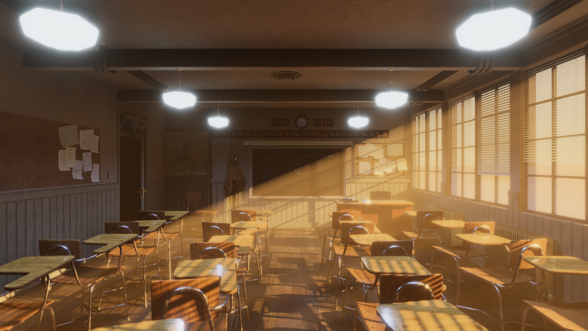

# HDRP-Classroom


HDRP conversion of the Blender Classroom scene by Christophe Seux (CC0)
https://www.blender.org/download/demo-files/

My example video rendered with this project:

[](https://youtu.be/EjGNVXJLKG0)

### Prerequisites
```
Unity 2021.3.0f1 or higher
```
```
Nvidia RTX GPU for DLSS
```

### Installation
Download or clone the repo and open the project in Unity 2021.3.0f1, it should rebuild the library.

Scenes are located in:
```
Assets/__Project/_Scenes
```

## Info
`
Disclaimer: This project is set up to the best of my current Unity knowledge and does not represent best practices.
`

The aim of the project was to produce a learning environment for new features of Unity 2021.3 HDRP. The scene has no baked lightmaps, instead using the new Adaptive Probe Volumes for Global Illumination.

[Unity Forum Adaptive Probe Volumes](https://forum.unity.com/threads/adaptive-probe-volumes-apvs-experimental-release-for-hdrp-in-2021-2.1238824/)

Timeline animation of Cinemachine cameras is included along with two variants of the scene.

#### Classroom Static:
* Uses Adaptive Probe Volume for GI
* Directional Light and ceiling Spot Lights use Static Shadow Caching
* All Game Objects marked as static

#### Classroom Dynamic:
* Uses Adaptive Probe Volume and Screen Space Global Illumination for GI
* Directional Light and ceiling Spot Light shadows are updated in realtime
* Background Game Objects are marked as static
* Static chairs get swapped out for a baked animated version
* Longer Timeline animation

### Asset Conversion
Scene geometry has been fixed for corrected Normals and UV mapping. Total materials are reduced from 73 in the original scene down to 20 for the Unity version. More objects share materials and have UV tiling baked into the meshes. Some objects have AO / colors baked into Vertex Colors which are sampled in their material shader (eg, Plastics). All non-tiling textures such as the paper drawings and blackboard have been combined into a single 4K texture to share the same material. All textures have been converted to PBR either manually in Substance Painter or using AI Image to Material in Substance Sampler, and exported as HDRP maps.

### Notes
Static Shadow Caching is performed at the beginning of the Timeline sequence using a camera that can see all Game Objects in view, but is hidden by the title screen. This avoids problems with some object shadows not being cached initially since the first animated camera zooms out from a close up of the blackboard.

[Unity Docs HDRP 12.1 Shadows](https://docs.unity3d.com/Packages/com.unity.render-pipelines.high-definition@12.1/manual/Shadows-in-HDRP.html)

A custom HDRP Lit shader is used to add Vertex Color sampling and enable Detail Maps. It is a modified version of the HDRP Lit Graph found at:
https://github.com/RemyUnity/SG-HDRP-Lit

If you find the project useful, have found improvements, or made anything cool with it feel free to tag me or get in touch:

[Hackmans Twitter Account](https://twitter.com/_hackmans_)

`https://twitter.com/_hackmans_`

### Performance
The scenes are mainly optimised for 1080p realtime playback and use DLSS. To increase performance, Depth Of Field for each Cinemachine VM camera can be set to lower quality. Volumetric Fog in the Global Volume can be set to lower quality. Contact Shadows and other features can be disabled in the Frame Settings of the Main Camera. Directional Light shadow resolution can be reduced.

Realistically there is a lot I would personally change about the scene including optimising the geometry more and baking some of the objects into their own maps and materials, but I wanted to keep this close to the original scene.